# 4X4 MIMO IN A NAKAGAMI-M FADING CHANNEL

**This project is associated as a part of the course credits for the Communication Networks Lab in the 6th Semester of ECE at MIT Manipal.**

**Final Grade: A+**

This repo is a MATLAB implementation of the research paper: 
[How significant is the assumption of the uniform channel phase distribution on the performance of spatial multiplexing MIMO system?](https://link.springer.com/article/10.1007/s11276-016-1286-z)

**The steps involved in the project are as follows:**

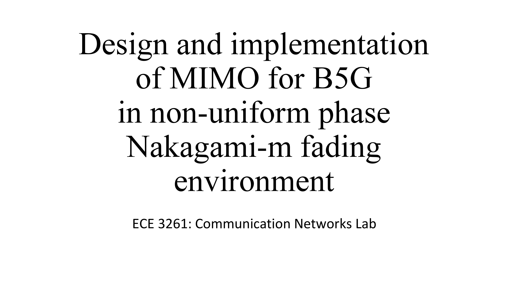

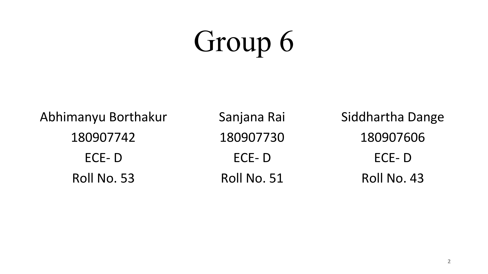

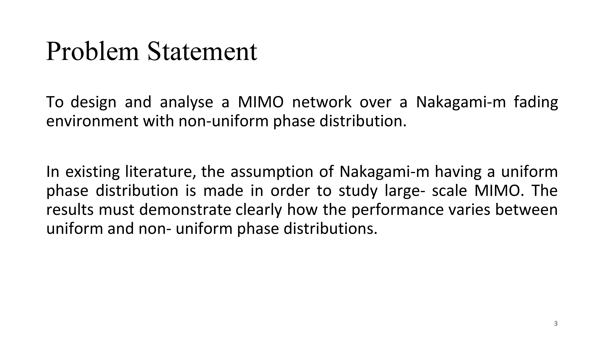

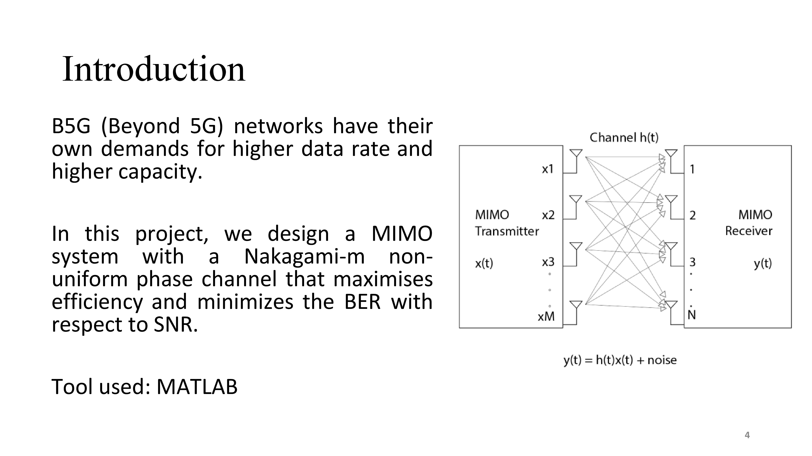

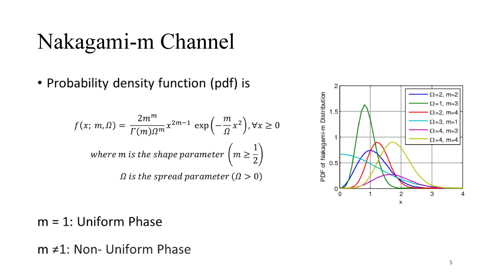

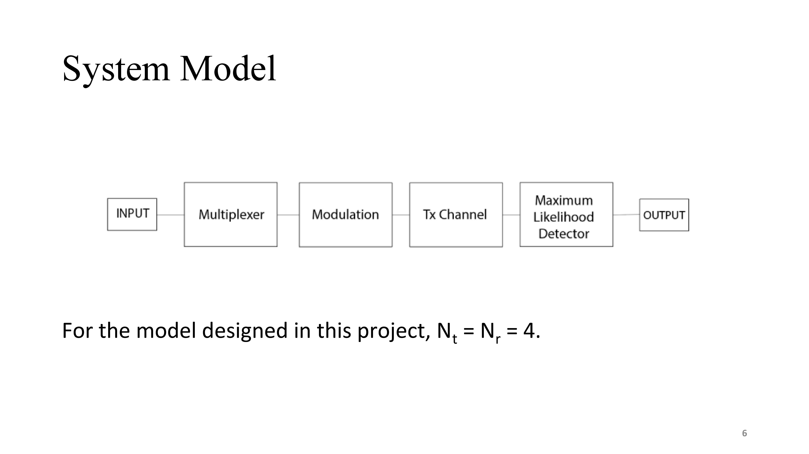

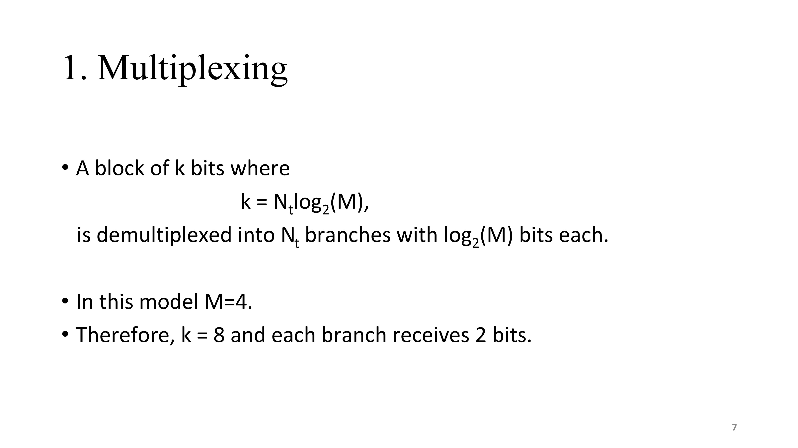

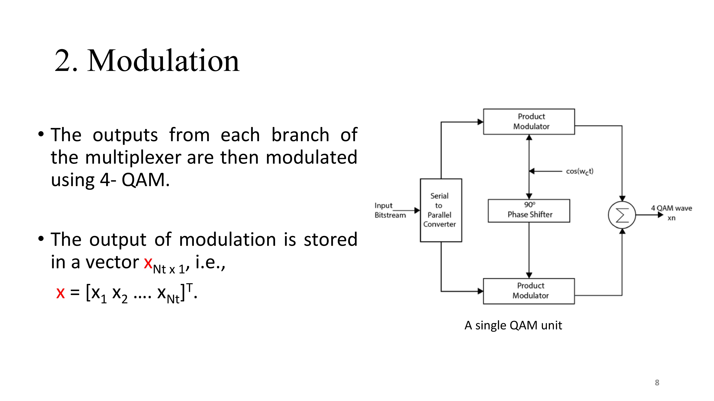

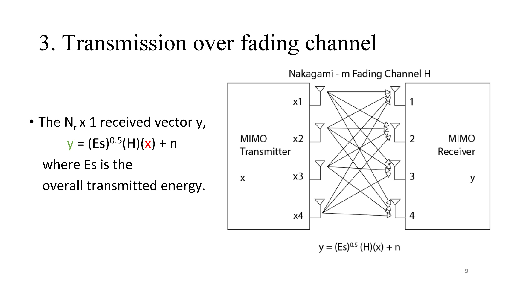

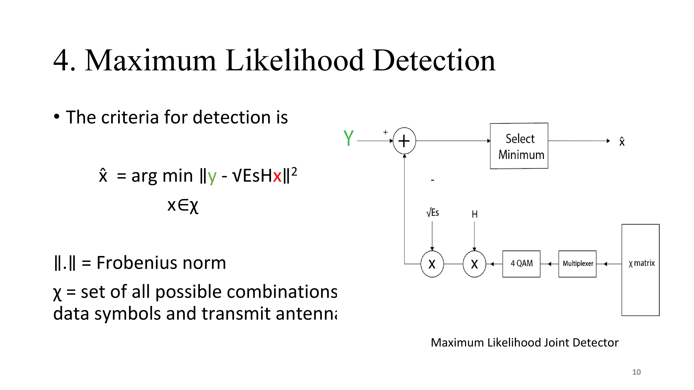

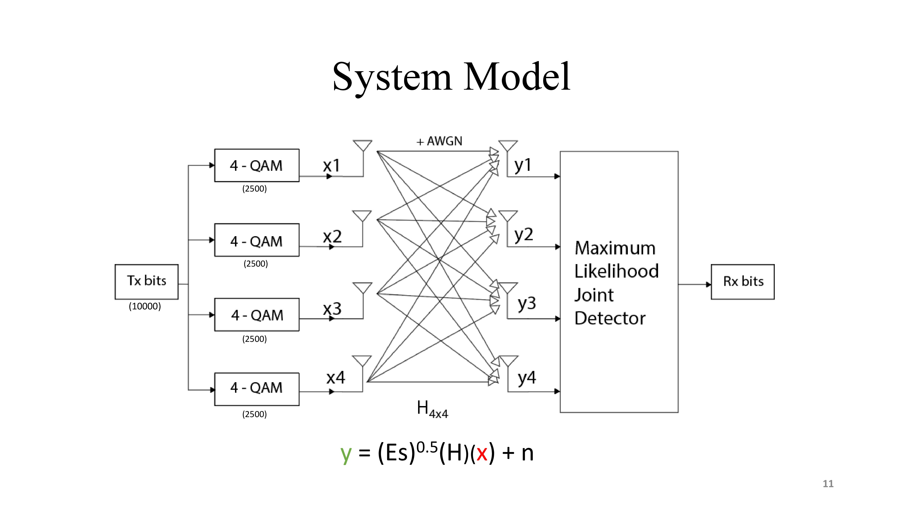

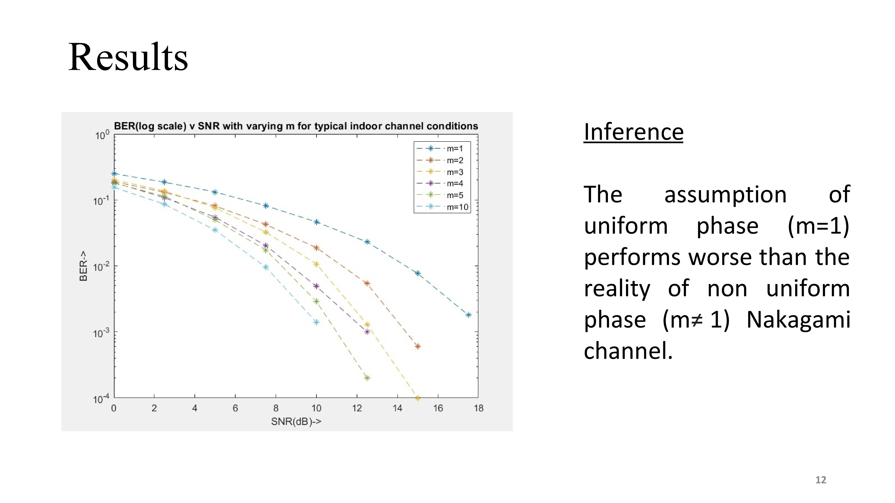

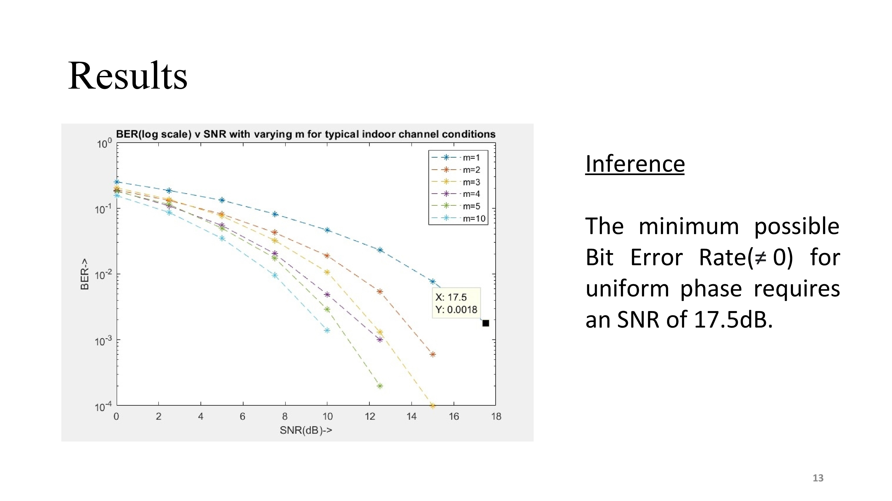

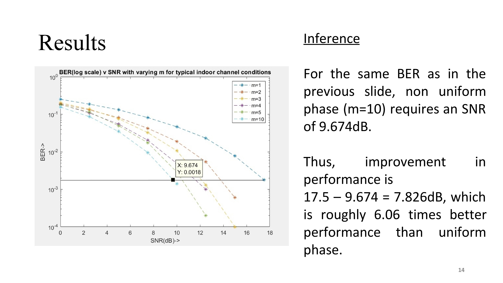

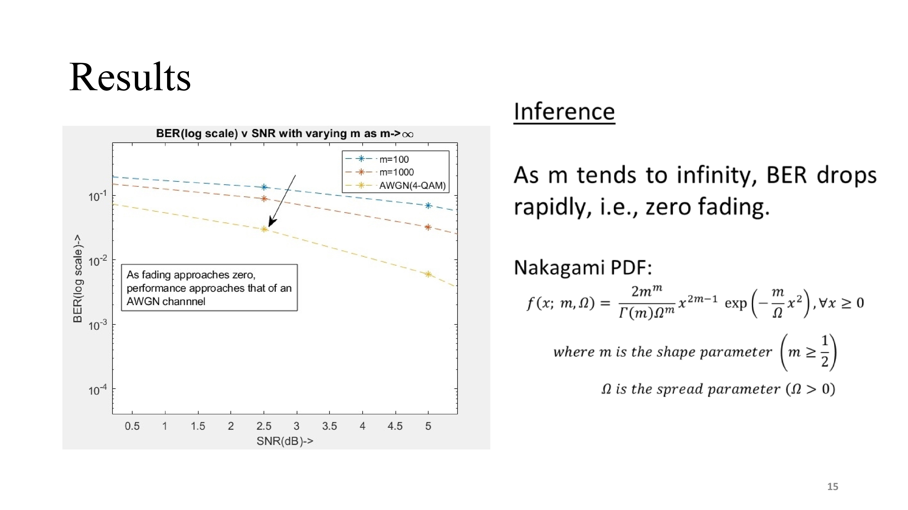

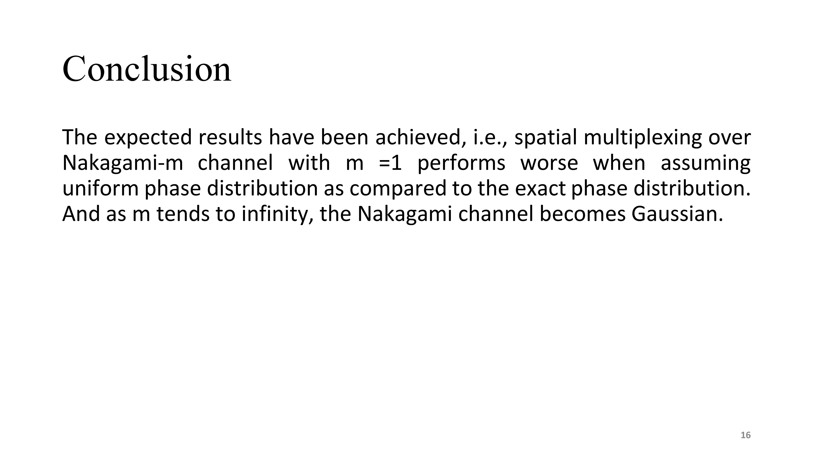

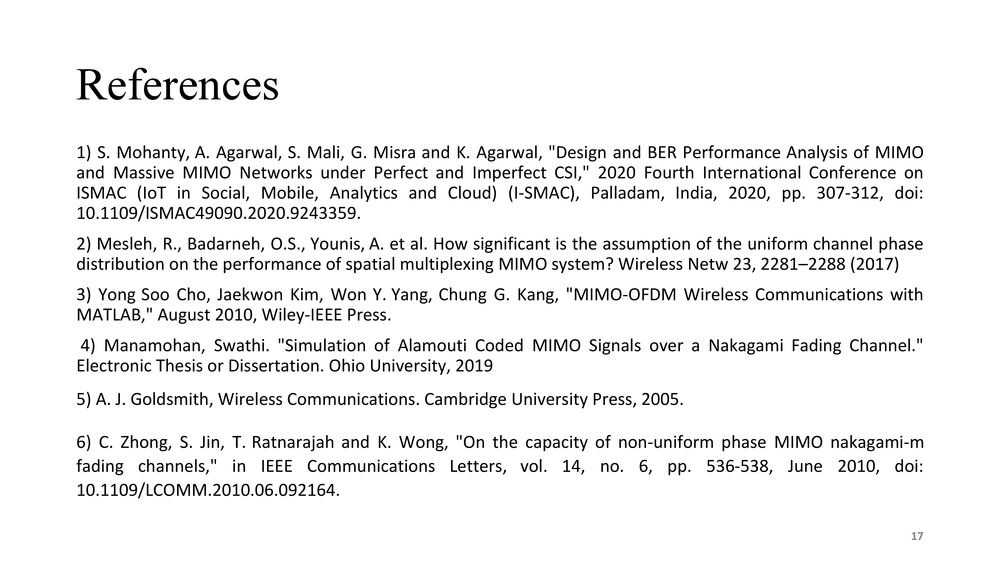
